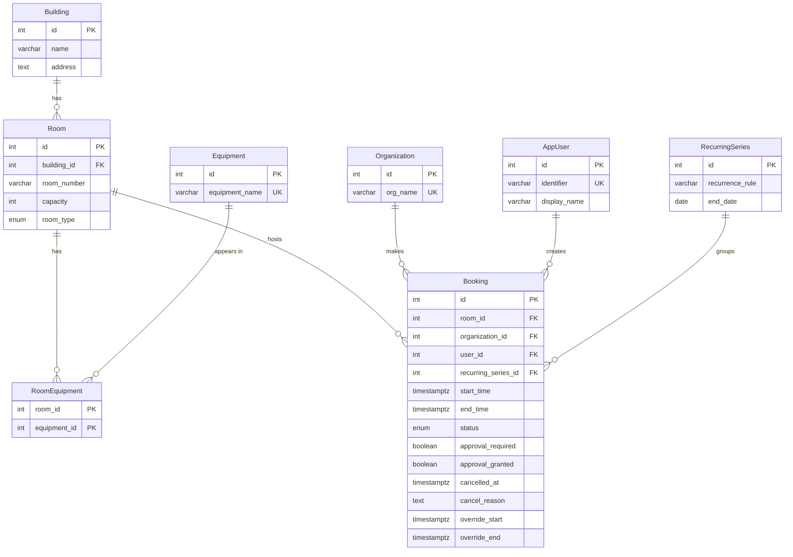

# Conceptual Model — University Room Booking System

## 1. Entities

| Entity | Attributes |
|---|---|
| **building** | `id` (PK), `name`, `address` |
| **room** | `id` (PK), `building_id` (FK), `room_number`, `capacity`, `room_type` |
| **equipment** | `id` (PK), `equipment_name` |
| **room_equipment** | `room_id` (PK, FK), `equipment_id` (PK, FK) — linking table |
| **organization** | `id` (PK), `org_name` |
| **app_user** | `id` (PK), `identifier`, `display_name` |
| **recurring_series** | `id` (PK), `recurrence_rule`, `end_date` |
| **booking** | `id` (PK), `room_id` (FK), `organization_id` (FK), `user_id` (FK), `recurring_series_id` (FK, nullable), `start_time`, `end_time`, `status`, `approval_required` (nullable), `approval_granted` (nullable), `cancelled_at` (nullable), `cancel_reason` (nullable), `override_start` (nullable), `override_end` (nullable) |

## 2. Relationships with Cardinalities

- A **building** contains one or more **rooms**; each room belongs to exactly one building **(1 : N)**.
- A **room** may have zero or more equipment items listed through the **room_equipment** junction; each equipment type can appear in many rooms. This is a many-to-many relationship **(M : N)** resolved via the `room_equipment` linking table:
  - A room can be linked to many rows in `room_equipment` **(1 : N)**.
  - An equipment type can be linked to many rows in `room_equipment` **(1 : N)**.
- A **room** hosts zero or more **bookings**; each booking reserves exactly one room **(1 : N)**.
- An **organization** makes zero or more **bookings**; each booking belongs to exactly one organization **(1 : N)**.
- An **app_user** creates zero or more **bookings**; each booking is created by exactly one user **(1 : N)**.
- A **recurring_series** optionally groups zero or more **bookings**; each booking may optionally belong to one recurring series **(1 : N, nullable FK)**. Bookings with a `NULL` `recurring_series_id` are one-off reservations.

## 3. ER Diagram

