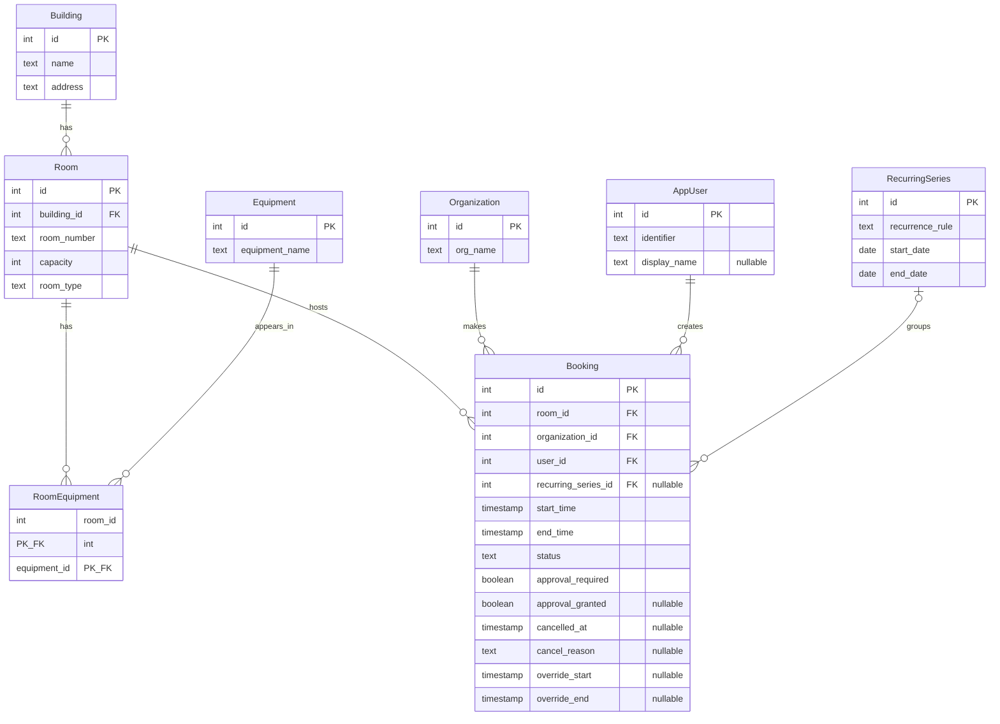

# Conceptual Model

## Entities
| Entity | Attributes |
|---|---|
| **building** | `id`, `name`, `address` |
| **room** | `id`, `building_id`, `room_number`, `capacity`, `room_type` |
| **equipment** | `id`, `equipment_name` |
| **room_equipment** | `room_id`, `equipment_id` |
| **organization** | `id`, `org_name` |
| **app_user** | `id`, `identifier`, `display_name` |
| **recurring_series** | `id`, `recurrence_rule`, `start_date`, `end_date` |
| **booking** | `id`, `room_id`, `organization_id`, `user_id`, `recurring_series_id`, `start_time`, `end_time`, `status`, `approval_required`, `approval_granted`, `cancelled_at`, `cancel_reason`, `override_start`, `override_end` |

## Relationships with Cardinalities
- A building contains one or more rooms; each room belongs to exactly one building (1 : N).
- A room may have zero or more equipment items listed through the room_equipment junction; each equipment type can appear in many rooms. Many-to-many relationship (M : N) resolved via the `room_equipment` linking table:
  - A room can be linked to many rows in `room_equipment` (1 : N).
  - An equipment type can be linked to many rows in `room_equipment` (1 : N).
- A room hosts zero or more bookings; each booking reserves exactly one room (1 : N).
- An organization makes zero or more bookings; each booking belongs to exactly one organization (1 : N).
- An app_user creates zero or more bookings; each booking is created by exactly one user (1 : N).
- A recurring_series optionally groups zero or more bookings; each booking may optionally belong to one recurring series (1 : N). Bookings with a `NULL` `recurring_series_id` are one-off reservations.

## ER Diagram
