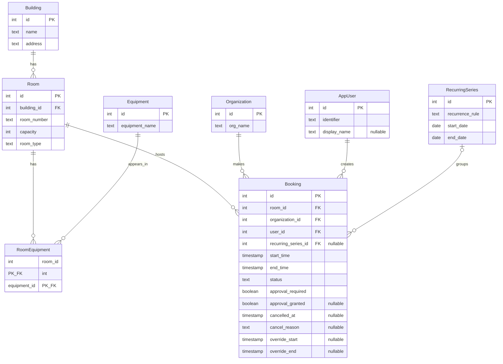

# Subject Analysis

## Candidate Subjects

| Subject | Description | Main Attributes |
|---|---|---|
| **Building** | A physical building on campus. | name, address |
| **Room** | A bookable space inside a building. | room number, capacity, room type |
| **Equipment** | An item that may be present in a room. | equipment name |
| **RoomEquipment** | The link between rooms and equipment. | room id, equipment id |
| **Organization** | A student organization that books rooms. | organization name |
| **AppUser** | The person who creates a booking for an organization. | identifier, optional display name |
| **RecurringSeries** | Parent entity for a set of repeated bookings. | recurrence rule, start date, end date |
| **Booking** | A reservation of a room for a time period. | room, organization, user, start time, end time, status, approval fields, cancellation fields, optional time override |

## Candidate Relationships

| Relationship | Cardinality | Notes |
|---|---|---|
| Building to room | 1 : N | A room belongs to one building. A building can contain many rooms. |
| Room to equipment | M : N | Implemented with `room_equipment`. A room can have many equipment items; an equipment type can appear in many rooms. |
| Room to equipment via room_equipment | 1 : N | A room can be linked to many rows in `room_equipment`. |
| Equipment to room_equipment | 1 : N | An equipment type can be linked to many rows in `room_equipment`. |
| Room to booking | 1 : N | A room can be booked many times. A booking reserves exactly one room. |
| Organization to booking | 1 : N | An organization has many bookings. Each booking belongs to one organization. |
| AppUser to booking | 1 : N | One person creates many bookings. Each booking is created by one user. |
| Recurring series to booking | optional 1 : N | A booking can be a one-off booking or part of one recurring series. |

## Key Assumptions

1. A booking belongs to one organization only. Joint bookings are outside this design.
2. Each booking uses exact start and end timestamps. The schema does not force 30-minute slots.
3. Equipment is a property of the room, not of a single booking.
4. Recurring bookings are stored as separate booking rows. The `recurring_series` row stores the repeating rule and date range, while each occurrence stores its own actual start and end time. An individual occurrence can also be moved to a different time using override start and end fields, without affecting the rest of the series.
5. A cancelled booking remains in the database with `status = 'cancelled'`, `cancelled_at`, and an optional reason. This keeps booking history available for reports.
6. Approval is stored on the booking because approval can depend on the room, date, organization, or other local rules. The schema prevents impossible combinations such as a granted approval when approval is not required.
7. The database prevents overlapping active bookings in the same room. The normal booking workflow should still check availability before trying to insert or confirm a booking.
8. User data is kept small. The schema stores a unique identifier and an optional display name only.

## Ambiguous points and chosen interpretation

| Ambiguity | Interpretation chosen |
|---|---|
| What personal data is needed for users? | Only a unique identifier is required. A display name is optional and only helps with readable reports. |
| Are approval details mandatory? | No. The design supports approval when needed, but ordinary bookings can have `approval_required = false`. |
| How should recurring bookings be represented? | A recurring series has a rule and date range, and every generated occurrence is stored as a normal booking row. This makes cancellation and reporting simple. |
| Can an occurrence in a recurring series be changed by itself? | Yes. Since each occurrence is a booking row, its time or status can be changed without changing the whole series. |
| Should the database store an approver or rejection reason? | Not in this version. The case does not clearly require it, so the design stays smaller. |
| Should the database delete old cancelled bookings? | No automatic deletion is included. Retention would be a policy decision outside this project. |

## Application queries covered by `queries.sql`

1. List bookings for a given room in a date range.
2. Find rooms of a given type and minimum capacity that are free in a given time window.
3. Summarize room usage, including confirmed hours and cancellation counts.
4. List the equipment available for the room used by a booking.
5. List bookings that still need an approval decision.
6. Show one organization's booking history in a date range.
7. List which equipment types appear most often in rooms that have had confirmed bookings.
8. Find active bookings that overlap in the same room.

# Conceptual Model

## Entities
| Entity | Attributes |
|---|---|
| **building** | `id`, `name`, `address` |
| **room** | `id`, `building_id`, `room_number`, `capacity`, `room_type` |
| **equipment** | `id`, `equipment_name` |
| **room_equipment** | `room_id`, `equipment_id` |
| **organization** | `id`, `org_name` |
| **app_user** | `id`, `identifier`, `display_name` |
| **recurring_series** | `id`, `recurrence_rule`, `start_date`, `end_date` |
| **booking** | `id`, `room_id`, `organization_id`, `user_id`, `recurring_series_id`, `start_time`, `end_time`, `status`, `approval_required`, `approval_granted`, `cancelled_at`, `cancel_reason`, `override_start`, `override_end` |

## Relationships with Cardinalities
- A building contains one or more rooms; each room belongs to exactly one building (1 : N).
- A room may have zero or more equipment items listed through the room_equipment junction; each equipment type can appear in many rooms. Many-to-many relationship (M : N) resolved via the `room_equipment` linking table:
  - A room can be linked to many rows in `room_equipment` (1 : N).
  - An equipment type can be linked to many rows in `room_equipment` (1 : N).
- A room hosts zero or more bookings; each booking reserves exactly one room (1 : N).
- An organization makes zero or more bookings; each booking belongs to exactly one organization (1 : N).
- An app_user creates zero or more bookings; each booking is created by exactly one user (1 : N).
- A recurring_series optionally groups zero or more bookings; each booking may optionally belong to one recurring series (1 : N). Bookings with a `NULL` `recurring_series_id` are one-off reservations.

## ER Diagram

# Relational Schema

The schema is written for PostgreSQL. It uses `SERIAL` integer primary keys, `TEXT` columns for names and labels, and `CHECK` constraints for controlled values such as room type and booking status. It also uses PostgreSQL's `btree_gist` extension for the room-overlap exclusion constraint. The table definitions below match `schema.sql`.

## `building`

Stores campus buildings.

| Column | Type | Constraints |
|---|---|---|
| `id` | `SERIAL` | primary key |
| `name` | `TEXT` | not null |
| `address` | `TEXT` | not null |

## `room`

Stores bookable rooms.

| Column | Type | Constraints |
|---|---|---|
| `id` | `SERIAL` | primary key |
| `building_id` | `INTEGER` | not null, foreign key to `building(id)` |
| `room_number` | `TEXT` | not null |
| `capacity` | `INTEGER` | not null, `capacity > 0` |
| `room_type` | `TEXT` | not null, one of `meeting_room`, `lecture_room`, `studio`, `workshop` |

`UNIQUE (building_id, room_number)` means the same room number can appear in different buildings, but not twice in the same building.

## `equipment`

Stores the equipment catalogue.

| Column | Type | Constraints |
|---|---|---|
| `id` | `SERIAL` | primary key |
| `equipment_name` | `TEXT` | not null, unique |

The seed data uses Projector, Whiteboard, Video Conference System, and 3D Printer.

## `room_equipment`

Links rooms to equipment. This resolves the many-to-many relationship.

| Column | Type | Constraints |
|---|---|---|
| `room_id` | `INTEGER` | not null, foreign key to `room(id)`, `ON DELETE CASCADE` |
| `equipment_id` | `INTEGER` | not null, foreign key to `equipment(id)`, `ON DELETE CASCADE` |

The primary key is `(room_id, equipment_id)`, so the same equipment type cannot be listed twice for the same room.

## `organization`

Stores student organizations.

| Column | Type | Constraints |
|---|---|---|
| `id` | `SERIAL` | primary key |
| `org_name` | `TEXT` | not null, unique |

## `app_user`

Stores the person who creates a booking. The table is called `app_user` because `user` is a PostgreSQL keyword.

| Column | Type | Constraints |
|---|---|---|
| `id` | `SERIAL` | primary key |
| `identifier` | `TEXT` | not null, unique |
| `display_name` | `TEXT` | nullable |

## `recurring_series`

Stores the rule for repeated bookings.

| Column | Type | Constraints |
|---|---|---|
| `id` | `SERIAL` | primary key |
| `recurrence_rule` | `TEXT` | not null |
| `start_date` | `DATE` | not null |
| `end_date` | `DATE` | not null, must be on or after `start_date` |

The actual occurrences are stored in `booking`. This makes each occurrence easy to cancel, reject, or report on, while the series row keeps the overall recurrence rule and date range.

## `booking`

Stores each room reservation.

| Column | Type | Constraints / meaning |
|---|---|---|
| `id` | `SERIAL` | primary key |
| `room_id` | `INTEGER` | not null, foreign key to `room(id)` |
| `organization_id` | `INTEGER` | not null, foreign key to `organization(id)` |
| `user_id` | `INTEGER` | not null, foreign key to `app_user(id)` |
| `recurring_series_id` | `INTEGER` | nullable, foreign key to `recurring_series(id)`, `ON DELETE SET NULL` |
| `start_time` | `TIMESTAMP` | not null |
| `end_time` | `TIMESTAMP` | not null, must be after `start_time` |
| `status` | `TEXT` | not null, one of `pending`, `confirmed`, `cancelled`, `rejected` |
| `approval_required` | `BOOLEAN` | not null, default false |
| `approval_granted` | `BOOLEAN` | nullable |
| `cancelled_at` | `TIMESTAMP` | nullable, required only when status is `cancelled` |
| `cancel_reason` | `TEXT` | nullable, allowed only when status is `cancelled` |
| `override_start` | `TIMESTAMP` | nullable, overrides `start_time` for a moved occurrence |
| `override_end` | `TIMESTAMP` | nullable, overrides `end_time` for a moved occurrence, must be after `override_start` if both are set |

Important checks in `schema.sql`:

- `end_time > start_time`.
- If both override fields are set, `override_end` must be after `override_start`.
- If approval is not required, `approval_granted` must be null.
- A booking that requires approval cannot be confirmed unless approval has been granted.
- Cancellation fields are only used for cancelled bookings.
- Active bookings for the same room cannot overlap. This is enforced with a PostgreSQL exclusion constraint over `room_id` and the effective time range, using `override_start`/`override_end` when set and falling back to `start_time`/`end_time` otherwise.

## Foreign key summary

| Child table | Column | Parent table | Delete behavior |
|---|---|---|---|
| `room` | `building_id` | `building` | restrict |
| `room_equipment` | `room_id` | `room` | cascade |
| `room_equipment` | `equipment_id` | `equipment` | cascade |
| `booking` | `room_id` | `room` | restrict |
| `booking` | `organization_id` | `organization` | restrict |
| `booking` | `user_id` | `app_user` | restrict |
| `booking` | `recurring_series_id` | `recurring_series` | set null |

Indexes are added for the most common joins and filters: room/time searches, organization history, user lookups, and recurring-series lookups. The exclusion constraint also supports the no-overlap rule for active bookings.

# Design-Quality Review

## Redundancy and anomaly risk

One risk is the pair `approval_required` and `approval_granted` in `booking`. Without checks, the table could store a booking where approval is not required but approval is still marked as granted. That would make the row hard to interpret and could lead to wrong approval reports. We revised the schema instead of leaving this only to application code. `schema.sql` has a check that keeps `approval_granted` null when approval is not required. It also prevents a booking that requires approval from becoming `confirmed` before `approval_granted = true`.

A second related risk is cancellation data. If `cancelled_at` or `cancel_reason` were allowed on non-cancelled rows, cancellation reports would become unreliable. The schema checks that cancellation fields are only used when `status = 'cancelled'`.

A third risk is double-booking a room. If two active bookings for the same room could overlap, the database would allow an impossible schedule even if reports could later detect it. The schema prevents this with a PostgreSQL exclusion constraint for bookings whose status is `pending` or `confirmed`.

## Functional dependencies

1. **`booking.id → room_id, organization_id, user_id, start_time, end_time, status`**  
   The booking id identifies one booking row, so it determines the room, organization, creator, time interval, and status of that booking.

2. **`room.building_id, room.room_number → room.id, capacity, room_type`**  
   Room numbers are unique inside a building, so a building and room number identify one room and its room facts.

3. **`room_id, COALESCE(override_start, start_time), COALESCE(override_end, end_time) → booking.id`** Because the database preserves cancelled and rejected reservations, the same room time-slot can technically map to multiple historical booking IDs over time. However, for any active or pending reservation, a specific room at a specific point in time maps uniquely to a single, distinct booking ID.

These dependencies connect to the anomaly discussion. Booking rows store `room_id` instead of repeating the building name, room number, and capacity, so room facts stay in `room` and booking facts stay in `booking`. The active-booking dependency also explains why overlapping bookings are treated as an integrity problem rather than only as a reporting problem.

## Privacy and data minimization

The user table stores only `identifier` and an optional `display_name`. It does not store phone numbers, home addresses, date of birth, or other personal details because those are not needed for booking rooms. The seed data uses synthetic users such as `user_001` rather than real names or emails. Cancellation reasons are optional free text, so in a real deployment they should be kept short and reviewed by a retention policy, especially if users might type personal information into them.

# Short Rationale

The main idea is to keep the design close to the real things in the case, which is buildings contain rooms, rooms have equipment, organizations make bookings, and users create those bookings. The `booking` table is the center of the schema. It connects one room, one organization, one user, and one time interval.

The hardest modelling decision was recurring bookings. We considered making a separate occurrence table, but that made the design more complicated without adding much value for this project. Instead, `recurring_series` stores the recurrence rule and date range, and each actual occurrence is stored as a normal row in `booking`. This means a single occurrence can be cancelled or rejected without changing the whole series, and reports can treat recurring and one-off bookings the same way. An occurrence can also be moved to a different time using `override_start` and `override_end`, without affecting the rest of the series.

The primary identifiers are surrogate integer keys because they keep joins simple and avoid depending on labels that might change. For example, an organization name could be renamed, and a room number could change after building renovations. The schema still protects natural identifiers where they matter: equipment names are unique, organization names are unique, and `(building_id, room_number)` is unique for rooms.

Normalization affected the equipment and room design. Equipment is not stored as repeated text columns inside `room`, because one room can have many equipment items and one equipment type can appear in many rooms. The linking table `room_equipment` keeps that many-to-many relationship clean and avoids duplicate equipment lists.

One assumption is that approval details do not need a separate approver table. The case only asks for optional approval-related information, so the design stores whether approval is required and whether it has been granted. If the system later needed audit trails, the next step would be an approval table with approver, decision time, and comment.